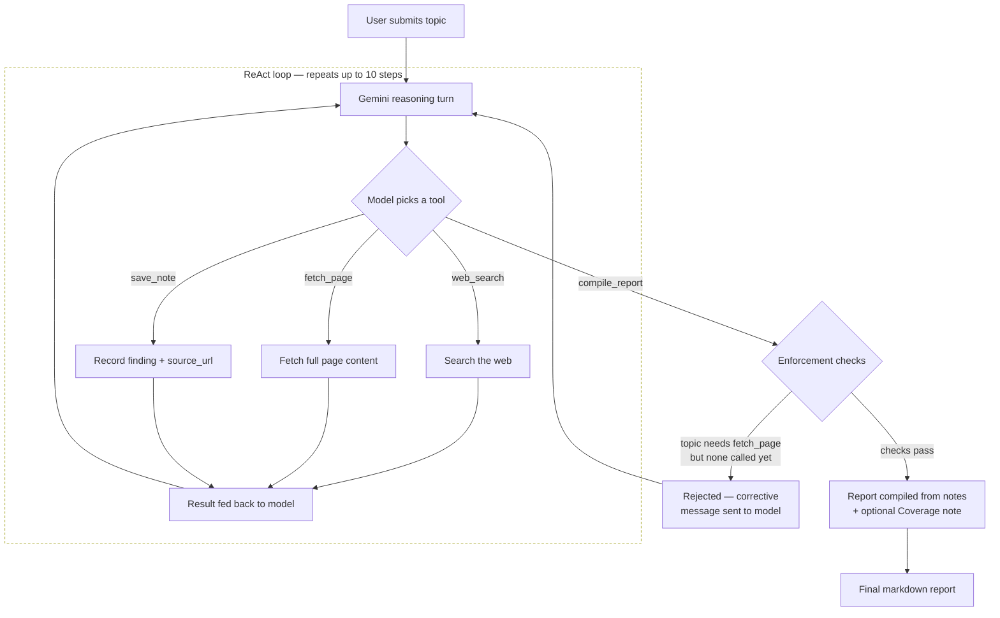

# AgentResearcher

AgentResearcher is an autonomous research agent: give it a topic, and it searches the web, reads full pages when a snippet isn't enough, takes structured notes with sources, self-assesses how well those sources actually match the topic, and compiles a cited markdown report — all without a human in the loop between the initial question and the final answer. It's built as a ReAct-style (Reason → Act → Observe) agent loop on top of Gemini's native function calling, with four tools (`web_search`, `fetch_page`, `save_note`, `compile_report`) that the model chooses between at each step, and a Streamlit UI that streams the reasoning trace live as it happens.

## Architecture



Each iteration is one Gemini turn: the model sees the full conversation so far (including every tool result) and decides what to do next — search again, fetch a promising URL, save a finding, or wrap up. The loop ends when the model successfully calls `compile_report`, or after 10 steps as a safety fallback.

## Design decisions & hardening

This section is the point of the README. Anyone can wire an LLM to a search API; the interesting part is what broke during testing and how it was fixed.

**Model choice: `gemini-flash-lite-latest`, not `gemini-3.6-flash`.** The first working version used `gemini-3.6-flash`. It's a stronger model, but its free-tier quota is 20 requests/day — and a single research loop burns 8–14 of those. Two live test runs in the same day exhausted the quota entirely, with the second run failing outright before producing a report. For a project meant to be demoed publicly (recruiters, reviewers, anyone clicking a link), a tool that dies after one or two uses isn't a demo, it's a trap. Switching to `gemini-flash-lite-latest` — which carries a separate, much higher free quota and is fast enough for tool-calling workloads — was a deliberate reliability tradeoff, not a downgrade taken lightly. `agent.py` documents this choice inline so it doesn't read as an accident to a future reader.

**`fetch_page` enforcement moved from prompt instructions to code.** The system instruction originally just told the model: "when a topic asks for a deep comparison or technical explanation, fetch a full page before compiling." Testing this directly — repeated live runs on "Compare the memory architectures of Mem0 and Letta in technical detail" — showed the model routinely ignored it. It would run 3–4 searches, write seven or eight detailed-sounding notes purely from search snippets, and call `compile_report` having never once called `fetch_page`. The notes read as confident and technical, but they were snippet-deep, not source-deep. Instruction-following alone wasn't a reliable enough guarantee for that quality bar.

The fix was to stop trusting the model's judgment on this specific point and enforce it in code: `topic_requires_fetch()` keyword-matches the topic string for comparison/deep-dive language ("compare", "architecture", "vs", "how does", etc.), and `_execute_tool` tracks whether `fetch_page` has been called during the run. If the model tries `compile_report` on a matching topic before ever calling `fetch_page`, the call is rejected — not with a crash, but with a structured tool response telling the model exactly what to do next ("call fetch_page on a promising URL, then try again"). This was verified directly against the tool-execution logic (rejection → corrective message → successful `fetch_page` → successful retry), since Gemini's signed `thought_signature` mechanism makes it impossible to forge a live model turn from outside the model itself for end-to-end testing.

**Source tracking was silently lossy, so it got redesigned.** The original `save_note(text)` just asked the model to inline the source URL somewhere in the note's prose, and `compile_report` regex-extracted `https?://\S+` from that text to build the Sources list. This looked fine in early tests. Then a real run on a thin, tangential-coverage topic (Malayalam-language LLM agent memory research) produced a report with five well-written findings and a Sources section reading **"No sources recorded"** — the model had written a note in a phrasing that didn't happen to include the literal URL string that run, and the regex found nothing. A citation system that can silently drop citations is worse than no citation system, because it looks trustworthy while being wrong. `save_note` now takes a required `source_url` parameter (enforced in the function schema, not just requested in the prompt), notes are stored as `{text, source_url}` structs, and `compile_report` reads `source_url` directly — no parsing, no chance of a URL existing but not being recognized.

**Coverage note: making thin research visibly thin.** Not every topic has real coverage. Ask this agent for research on a narrow, mostly-nonexistent intersection (e.g. Malayalam-language academic papers specifically on LLM agent memory) and it will still find *something* — but presenting five confident-sounding bullet points from tangentially related sources with the same tone as a well-covered topic would be a quiet form of overclaiming. The system instruction now requires the model to explicitly assess, before calling `compile_report`, whether its notes are strongly on-topic or only adjacent/sparse, and to pass a plain-language `coverage_note` in the latter case (e.g. *"Limited direct research exists on this exact topic; the following are the closest related sources found."*). `compile_report` renders this as a `## Coverage note` callout at the top of the report, before the findings — so a reader sees the caveat before the content, not buried after it.

**A malformed tool call used to crash the whole loop.** Stress-testing (re-running the same topic repeatedly to shake out flaky model behavior) turned up an intermittent case: occasionally the model emits a tool call with a missing or empty required argument — a `web_search` call with no `query`, for instance. The original code did `args["query"]` directly, which raised an unhandled `KeyError` and killed the entire run, discarding every note gathered up to that point. The fix validates required arguments per tool before executing anything, and on failure returns a structured rejection back to the model (the same mechanism used for the `fetch_page` enforcement) instead of raising. Re-running the same topic three times back-to-back after the fix produced zero crashes.

## Example trace

Real run: **"Compare the memory architectures of Mem0 and Letta in technical detail"**

```
1. [web_search] query: "Mem0 memory architecture technical details"
   -> 5 result(s)
2. [web_search] query: "Letta memory architecture technical details memgpt"
   -> 5 result(s)
3. [web_search] query: "site:vectorize.io Mem0 vs Letta AI Agent Memory Compared"
   -> 5 result(s)
4. [fetch_page] url: "https://mem0.ai/blog/multi-agent-memory-systems"
   -> fetched 31990 chars
5. [save_note] source_url: "https://mem0.ai/blog/multi-agent-memory-systems"
   -> saved note: Mem0 implements multi-level memory scoping across four dimensions...
6. [save_note] source_url: "https://mem0.ai/blog/multi-agent-memory-systems"
   -> saved note: Mem0 combines three storage backends under the hood...
7. [save_note] source_url: "https://medium.com/@piyush.jhamb4u/stateful-ai-agents-..."
   -> saved note: Letta organizes memory into tiered structures inspired by operating systems...
8. [save_note] source_url: "https://vectorize.io/articles/mem0-vs-letta"
   -> saved note: Architectural paradigm contrast: Mem0 is a framework-agnostic modular memory layer...
9. [compile_report] topic: "Compare the memory architectures of Mem0 and Letta in technical detail"
   -> compiled report (4 notes)
```

Final report excerpt:

> ## Findings
>
> - Mem0 implements multi-level memory scoping across four dimensions: user_id (personal memories), agent_id (bot-specific context), run_id (session isolation), and app_id (application-level defaults). (Source: https://mem0.ai/blog/multi-agent-memory-systems)
> - Letta organizes memory into tiered structures inspired by operating systems and virtual memory: Core Memory (in-context memory blocks like persona/human limits), Self-Editing Memory (agent-driven tool execution for memory updates), and Out-of-Context Archival/Recall memory. (Source: https://medium.com/@piyush.jhamb4u/stateful-ai-agents-a-deep-dive-into-letta-memgpt-memory-models-a2ffc01a7ea1)
> - Architectural paradigm contrast: Mem0 is a framework-agnostic modular memory layer/API that handles passive or active extraction beneath any agent framework; Letta is an agent runtime and OS-inspired platform where agents live, execute, and actively manage their own memory via self-editing tools. (Source: https://vectorize.io/articles/mem0-vs-letta)
>
> ## Sources
>
> 1. https://mem0.ai/blog/multi-agent-memory-systems
> 2. https://medium.com/@piyush.jhamb4u/stateful-ai-agents-a-deep-dive-into-letta-memgpt-memory-models-a2ffc01a7ea1
> 3. https://vectorize.io/articles/mem0-vs-letta

Note `fetch_page` firing at step 4, before any notes are saved — this is the enforcement mechanism described above working as intended on a topic that matched `topic_requires_fetch()`.

## Tech stack

- **Reasoning:** Google Gemini (`gemini-flash-lite-latest`) via `google-genai`, using native function calling
- **Search & page extraction:** Tavily (`tavily-python`)
- **UI:** Streamlit
- **Language:** Python 3

## Running locally

```bash
git clone https://github.com/heytanix/AgentResearcher.git
cd AgentResearcher
python3 -m venv .venv && source .venv/bin/activate
pip install -r requirements.txt
```

Create a `.env` file (see `.env.example`) with:

```
GEMINI_API_KEY=your-key-here
TAVILY_API_KEY=your-key-here
```

Then run:

```bash
streamlit run app.py
```

### Deploying (Streamlit Community Cloud)

API keys resolve from `os.environ` first, then fall back to `st.secrets` (see `tools/config.py`) — so the same code runs unmodified locally and on Streamlit Cloud. On Streamlit Cloud, set `GEMINI_API_KEY` and `TAVILY_API_KEY` in the app's **Secrets** panel instead of a `.env` file.

**Live demo:** [TODO: add deployment link]

## Limitations & honesty

- **Tavily's free-tier credit ceiling is shared across every user of the live demo.** If the demo is getting traffic, search/fetch calls can fail once that shared quota is exhausted for the period — this isn't a per-user limit, it's a project-wide one.
- **`fetch_page` enforcement is keyword-based, not a real classifier.** `topic_requires_fetch()` matches on phrases like "compare," "architecture," "vs," and "how does." It will miss topics that call for deep sourcing without using those words, and could in principle over-trigger on a topic that merely mentions one of those words in passing. It's a pragmatic guardrail proven to catch the specific failure mode found in testing, not a general solution to "does this topic need a full page read."
